# Schéma de Base de Données

## Vue d'ensemble

Ce document décrit le schéma de base de données pour l'application de gestion de ressources personnelles. La base de données utilise **PostgreSQL** avec **Prisma** comme ORM.

## Diagramme Entité-Relation



## Tables

### 1. Users (Utilisateurs)

Table principale pour la gestion des utilisateurs.

| Colonne | Type | Contraintes | Description |
|---------|------|-------------|-------------|
| `id` | UUID | PK | Identifiant unique |
| `email` | VARCHAR(255) | UNIQUE, NOT NULL | Email de l'utilisateur |
| `password` | VARCHAR(255) | NOT NULL | Mot de passe hashé (bcrypt) |
| `name` | VARCHAR(100) | NOT NULL | Nom d'affichage |
| `created_at` | TIMESTAMP | DEFAULT NOW() | Date de création |
| `updated_at` | TIMESTAMP | AUTO UPDATE | Date de modification |

---

### 2. Resources (Ressources)

Table centrale contenant toutes les ressources de l'utilisateur.

| Colonne | Type | Contraintes | Description |
|---------|------|-------------|-------------|
| `id` | UUID | PK | Identifiant unique |
| `title` | VARCHAR(255) | NOT NULL | Titre de la ressource |
| `description` | TEXT | NULLABLE | Description détaillée |
| `type` | ENUM | NOT NULL | Type: `link`, `document`, `contact`, `event`, `note` |
| `content` | JSONB | NOT NULL | Contenu spécifique selon le type |
| `is_favorite` | BOOLEAN | DEFAULT FALSE | Marqué comme favori |
| `user_id` | UUID | FK → Users | Propriétaire |
| `category_id` | UUID | FK → Categories, NULLABLE | Catégorie assignée |
| `created_at` | TIMESTAMP | DEFAULT NOW() | Date de création |
| `updated_at` | TIMESTAMP | AUTO UPDATE | Date de modification |

#### Structure du champ `content` selon le type

**Type: `link`**
```json
{
  "url": "https://example.com",
  "preview_image": "https://..." 
}
```

**Type: `document`**
```json
{
  "file_path": "/uploads/doc123.pdf",
  "file_size": 1024000,
  "mime_type": "application/pdf"
}
```

**Type: `contact`**
```json
{
  "email": "contact@example.com",
  "phone": "+33612345678",
  "company": "Company Name",
  "position": "CTO",
  "address": "123 Street"
}
```

**Type: `event`**
```json
{
  "event_date": "2025-03-15T14:00:00Z",
  "location": "Paris",
  "reminder_date": "2025-03-12T09:00:00Z"
}
```

**Type: `note`**
```json
{
  "content": "Contenu de la note en texte..."
}
```

---

### 3. Categories (Catégories)

Catégories personnalisées pour organiser les ressources.

| Colonne | Type | Contraintes | Description |
|---------|------|-------------|-------------|
| `id` | UUID | PK | Identifiant unique |
| `name` | VARCHAR(100) | NOT NULL | Nom de la catégorie |
| `color` | VARCHAR(7) | NULLABLE | Couleur hex (#RRGGBB) |
| `user_id` | UUID | FK → Users | Propriétaire |
| `created_at` | TIMESTAMP | DEFAULT NOW() | Date de création |

**Index**: `UNIQUE(user_id, name)` - Un utilisateur ne peut pas avoir deux catégories avec le même nom.

---

### 4. Tags (Étiquettes)

Tags pour la classification transversale des ressources.

| Colonne | Type | Contraintes | Description |
|---------|------|-------------|-------------|
| `id` | UUID | PK | Identifiant unique |
| `name` | VARCHAR(50) | NOT NULL | Nom du tag (normalisé en lowercase) |
| `user_id` | UUID | FK → Users | Propriétaire |
| `created_at` | TIMESTAMP | DEFAULT NOW() | Date de création |

**Index**: `UNIQUE(user_id, name)` - Un utilisateur ne peut pas avoir deux tags identiques.

---

### 5. ResourceTags (Table de liaison)

Relation many-to-many entre Resources et Tags.

| Colonne | Type | Contraintes | Description |
|---------|------|-------------|-------------|
| `resource_id` | UUID | FK → Resources, PK | ID de la ressource |
| `tag_id` | UUID | FK → Tags, PK | ID du tag |

**Clé primaire composite**: `(resource_id, tag_id)`

---

### 6. Collections (Optionnel - MVP+)

Regroupement thématique de ressources.

| Colonne | Type | Contraintes | Description |
|---------|------|-------------|-------------|
| `id` | UUID | PK | Identifiant unique |
| `name` | VARCHAR(100) | NOT NULL | Nom de la collection |
| `description` | TEXT | NULLABLE | Description |
| `user_id` | UUID | FK → Users | Propriétaire |
| `created_at` | TIMESTAMP | DEFAULT NOW() | Date de création |

---

### 7. CollectionResources (Table de liaison - Optionnel)

Relation many-to-many entre Collections et Resources.

| Colonne | Type | Contraintes | Description |
|---------|------|-------------|-------------|
| `collection_id` | UUID | FK → Collections, PK | ID de la collection |
| `resource_id` | UUID | FK → Resources, PK | ID de la ressource |

---

## Index recommandés

```sql
-- Recherche par titre et description
CREATE INDEX idx_resources_title ON resources USING gin(to_tsvector('french', title));
CREATE INDEX idx_resources_description ON resources USING gin(to_tsvector('french', description));

-- Filtrage fréquent
CREATE INDEX idx_resources_type ON resources(type);
CREATE INDEX idx_resources_user_id ON resources(user_id);
CREATE INDEX idx_resources_category_id ON resources(category_id);
CREATE INDEX idx_resources_is_favorite ON resources(is_favorite);
CREATE INDEX idx_resources_created_at ON resources(created_at DESC);

-- Tags
CREATE INDEX idx_tags_name ON tags(name);
CREATE INDEX idx_resource_tags_resource_id ON resource_tags(resource_id);
CREATE INDEX idx_resource_tags_tag_id ON resource_tags(tag_id);
```

---

## Migrations

Les migrations sont gérées automatiquement par **Prisma**. 

```bash
# Créer une nouvelle migration
npx prisma migrate dev --name init

# Appliquer les migrations en production
npx prisma migrate deploy

# Réinitialiser la base (développement uniquement)
npx prisma migrate reset
```

---

## Seed Data

Un script de seed est disponible pour initialiser la base avec des données de démonstration :

```bash
npx prisma db seed
```

Voir `prisma/seed.ts` pour les données de test.
