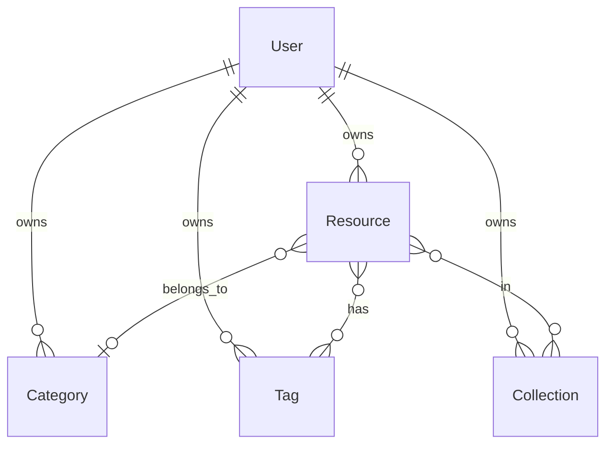

# Définition des Routes API et des Échanges de Données

> **Issue #21** - Jour 2 : Documentation des routes API

Ce document définit toutes les routes API de l'application Resource Manager, les formats de données échangés, et les codes de réponse HTTP.

## Table des Matières

1. [Vue d'ensemble](#vue-densemble)
2. [Authentification](#authentification)
3. [Ressources](#ressources)
4. [Catégories](#catégories)
5. [Tags](#tags)
6. [Collections (MVP+)](#collections-mvp)

---

## Vue d'ensemble

### Base URL
```
/api
```

### Headers requis

| Header | Valeur | Description |
|--------|--------|-------------|
| `Content-Type` | `application/json` | Format des données |
| `Authorization` | `Bearer <token>` | Token JWT (routes protégées) |

### Codes de réponse HTTP

| Code | Description |
|------|-------------|
| `200` | Succès |
| `201` | Ressource créée |
| `204` | Succès sans contenu (DELETE) |
| `400` | Requête invalide (validation) |
| `401` | Non authentifié |
| `403` | Non autorisé |
| `404` | Ressource non trouvée |
| `409` | Conflit (doublon) |
| `500` | Erreur serveur |

---

## Authentification

### POST `/auth/register`

Créer un nouveau compte utilisateur.

**Request Body:**
```json
{
  "email": "user@example.com",
  "password": "securePassword123",
  "name": "John Doe"
}
```

**Validation:**
- `email`: string, format email, unique
- `password`: string, min 6 caractères
- `name`: string, min 2 caractères

**Response 201:**
```json
{
  "access_token": "eyJhbGciOiJIUzI1NiIsInR5cCI6IkpXVCJ9..."
}
```

**Erreurs:**
- `400`: Données de validation invalides
- `409`: Email déjà utilisé

---

### POST `/auth/login`

Authentifier un utilisateur existant.

**Request Body:**
```json
{
  "email": "user@example.com",
  "password": "securePassword123"
}
```

**Response 200:**
```json
{
  "access_token": "eyJhbGciOiJIUzI1NiIsInR5cCI6IkpXVCJ9..."
}
```

**Erreurs:**
- `400`: Données de validation invalides
- `401`: Email ou mot de passe incorrect

---

### GET `/auth/me` 🔒

Récupérer le profil de l'utilisateur connecté.

**Response 200:**
```json
{
  "id": "uuid",
  "email": "user@example.com",
  "name": "John Doe",
  "createdAt": "2026-01-20T10:00:00.000Z",
  "updatedAt": "2026-01-20T10:00:00.000Z"
}
```

---

## Ressources

> 🔒 Toutes les routes nécessitent une authentification

### Types de ressources

```typescript
enum ResourceType {
  link = "link",
  document = "document",
  contact = "contact",
  event = "event",
  note = "note"
}
```

### Structure du champ `content` par type

| Type | Structure JSON |
|------|----------------|
| `link` | `{ "url": "https://..." }` |
| `document` | `{ "filePath": "...", "mimeType": "..." }` |
| `contact` | `{ "email": "...", "phone": "...", "company": "..." }` |
| `event` | `{ "eventDate": "ISO8601", "location": "..." }` |
| `note` | `{ "content": "..." }` |

---

### GET `/resources` 🔒

Récupérer toutes les ressources de l'utilisateur avec filtres et pagination.

**Query Parameters:**

| Param | Type | Description |
|-------|------|-------------|
| `type` | string | Filtrer par type (`link`, `document`, etc.) |
| `categoryId` | uuid | Filtrer par catégorie |
| `tagIds` | uuid[] | Filtrer par tags (séparés par virgules) |
| `isFavorite` | boolean | Filtrer les favoris |
| `search` | string | Recherche par titre/description |
| `sortBy` | string | Champ de tri (`createdAt`, `title`) |
| `sortOrder` | string | Ordre de tri (`asc`, `desc`) |
| `page` | number | Numéro de page (défaut: 1) |
| `limit` | number | Éléments par page (défaut: 20, max: 100) |

**Response 200:**
```json
{
  "data": [
    {
      "id": "uuid",
      "title": "Article intéressant",
      "description": "Un article sur...",
      "type": "link",
      "content": { "url": "https://example.com/article" },
      "isFavorite": false,
      "createdAt": "2026-01-20T10:00:00.000Z",
      "updatedAt": "2026-01-20T10:00:00.000Z",
      "category": {
        "id": "uuid",
        "name": "Travail",
        "color": "#3B82F6"
      },
      "tags": [
        { "id": "uuid", "name": "productivité" },
        { "id": "uuid", "name": "lecture" }
      ]
    }
  ],
  "pagination": {
    "page": 1,
    "limit": 20,
    "total": 45,
    "totalPages": 3
  }
}
```

---

### GET `/resources/:id` 🔒

Récupérer une ressource par son ID.

**Response 200:**
```json
{
  "id": "uuid",
  "title": "Article intéressant",
  "description": "Un article sur...",
  "type": "link",
  "content": { "url": "https://example.com/article" },
  "isFavorite": false,
  "createdAt": "2026-01-20T10:00:00.000Z",
  "updatedAt": "2026-01-20T10:00:00.000Z",
  "category": {
    "id": "uuid",
    "name": "Travail",
    "color": "#3B82F6"
  },
  "tags": [
    { "id": "uuid", "name": "productivité" }
  ]
}
```

**Erreurs:**
- `404`: Ressource non trouvée

---

### POST `/resources` 🔒

Créer une nouvelle ressource.

**Request Body:**
```json
{
  "title": "Nouveau lien",
  "description": "Description optionnelle",
  "type": "link",
  "content": { "url": "https://example.com" },
  "categoryId": "uuid (optionnel)",
  "tagIds": ["uuid1", "uuid2"]
}
```

**Validation:**
- `title`: string, obligatoire, min 1 caractère
- `type`: enum ResourceType, obligatoire
- `content`: object, structure validée selon le type
- `categoryId`: uuid, optionnel
- `tagIds`: uuid[], optionnel

**Response 201:**
```json
{
  "id": "uuid",
  "title": "Nouveau lien",
  "description": "Description optionnelle",
  "type": "link",
  "content": { "url": "https://example.com" },
  "isFavorite": false,
  "createdAt": "2026-01-20T10:00:00.000Z",
  "updatedAt": "2026-01-20T10:00:00.000Z",
  "category": null,
  "tags": []
}
```

---

### PUT `/resources/:id` 🔒

Mettre à jour une ressource existante.

**Request Body:** (tous les champs optionnels)
```json
{
  "title": "Titre mis à jour",
  "description": "Nouvelle description",
  "content": { "url": "https://new-url.com" },
  "categoryId": "uuid",
  "tagIds": ["uuid1"],
  "isFavorite": true
}
```

**Response 200:** Ressource mise à jour (même format que GET)

**Erreurs:**
- `404`: Ressource non trouvée

---

### DELETE `/resources/:id` 🔒

Supprimer une ressource.

**Response 204:** No Content

**Erreurs:**
- `404`: Ressource non trouvée

---

### PATCH `/resources/:id/favorite` 🔒

Basculer le statut favori d'une ressource.

**Response 200:**
```json
{
  "id": "uuid",
  "isFavorite": true
}
```

---

## Catégories

> 🔒 Toutes les routes nécessitent une authentification

### GET `/categories` 🔒

Récupérer toutes les catégories de l'utilisateur.

**Response 200:**
```json
{
  "data": [
    {
      "id": "uuid",
      "name": "Travail",
      "color": "#3B82F6",
      "createdAt": "2026-01-20T10:00:00.000Z",
      "_count": {
        "resources": 12
      }
    }
  ]
}
```

---

### POST `/categories` 🔒

Créer une nouvelle catégorie.

**Request Body:**
```json
{
  "name": "Personnel",
  "color": "#10B981"
}
```

**Validation:**
- `name`: string, obligatoire, unique par utilisateur
- `color`: string, format hex (#RRGGBB), optionnel

**Response 201:**
```json
{
  "id": "uuid",
  "name": "Personnel",
  "color": "#10B981",
  "createdAt": "2026-01-20T10:00:00.000Z"
}
```

**Erreurs:**
- `409`: Une catégorie avec ce nom existe déjà

---

### PUT `/categories/:id` 🔒

Mettre à jour une catégorie.

**Request Body:**
```json
{
  "name": "Professionnel",
  "color": "#6366F1"
}
```

**Response 200:** Catégorie mise à jour

---

### DELETE `/categories/:id` 🔒

Supprimer une catégorie. Les ressources associées auront leur `categoryId` mis à `null`.

**Response 204:** No Content

---

## Tags

> 🔒 Toutes les routes nécessitent une authentification

### GET `/tags` 🔒

Récupérer tous les tags de l'utilisateur.

**Query Parameters:**

| Param | Type | Description |
|-------|------|-------------|
| `search` | string | Recherche par nom (autocomplete) |

**Response 200:**
```json
{
  "data": [
    {
      "id": "uuid",
      "name": "productivité",
      "createdAt": "2026-01-20T10:00:00.000Z",
      "_count": {
        "resources": 8
      }
    }
  ]
}
```

---

### POST `/tags` 🔒

Créer un nouveau tag.

**Request Body:**
```json
{
  "name": "important"
}
```

**Validation:**
- `name`: string, obligatoire, unique par utilisateur, normalisé en lowercase

**Response 201:**
```json
{
  "id": "uuid",
  "name": "important",
  "createdAt": "2026-01-20T10:00:00.000Z"
}
```

**Erreurs:**
- `409`: Un tag avec ce nom existe déjà

---

### DELETE `/tags/:id` 🔒

Supprimer un tag. Les associations avec les ressources seront supprimées.

**Response 204:** No Content

---

## Collections (MVP+)

> 🔒 Toutes les routes nécessitent une authentification
> ⚠️ Fonctionnalité optionnelle (Niveau 1)

### GET `/collections` 🔒

Récupérer toutes les collections de l'utilisateur.

**Response 200:**
```json
{
  "data": [
    {
      "id": "uuid",
      "name": "Veille technologique",
      "description": "Articles et ressources tech",
      "createdAt": "2026-01-20T10:00:00.000Z",
      "_count": {
        "resources": 15
      }
    }
  ]
}
```

---

### POST `/collections` 🔒

Créer une nouvelle collection.

**Request Body:**
```json
{
  "name": "Veille technologique",
  "description": "Articles et ressources tech"
}
```

**Response 201:** Collection créée

---

### PUT `/collections/:id` 🔒

Mettre à jour une collection.

---

### DELETE `/collections/:id` 🔒

Supprimer une collection (les ressources ne sont pas supprimées).

---

### POST `/collections/:id/resources` 🔒

Ajouter une ressource à une collection.

**Request Body:**
```json
{
  "resourceId": "uuid"
}
```

---

### DELETE `/collections/:id/resources/:resourceId` 🔒

Retirer une ressource d'une collection.

---

## Schémas Zod (Contrats)

Les schémas Zod suivants doivent être ajoutés au package `contracts` pour la validation côté frontend et backend :

### lib/contracts/src/resources/schemas.ts

```typescript
import { z } from 'zod';

export const ResourceTypeSchema = z.enum([
  'link',
  'document',
  'contact',
  'event',
  'note',
]);

export const LinkContentSchema = z.object({
  url: z.string().url(),
});

export const DocumentContentSchema = z.object({
  filePath: z.string(),
  mimeType: z.string(),
});

export const ContactContentSchema = z.object({
  email: z.string().email().optional(),
  phone: z.string().optional(),
  company: z.string().optional(),
});

export const EventContentSchema = z.object({
  eventDate: z.string().datetime(),
  location: z.string().optional(),
});

export const NoteContentSchema = z.object({
  content: z.string(),
});

export const ResourceContentSchema = z.union([
  LinkContentSchema,
  DocumentContentSchema,
  ContactContentSchema,
  EventContentSchema,
  NoteContentSchema,
]);

export const CreateResourceDtoSchema = z.object({
  title: z.string().min(1),
  description: z.string().optional(),
  type: ResourceTypeSchema,
  content: ResourceContentSchema,
  categoryId: z.string().uuid().optional(),
  tagIds: z.array(z.string().uuid()).optional(),
});

export const UpdateResourceDtoSchema = CreateResourceDtoSchema.partial().extend({
  isFavorite: z.boolean().optional(),
});
```

### lib/contracts/src/categories/schemas.ts

```typescript
import { z } from 'zod';

export const CreateCategoryDtoSchema = z.object({
  name: z.string().min(1).max(50),
  color: z.string().regex(/^#[0-9A-Fa-f]{6}$/).optional(),
});

export const UpdateCategoryDtoSchema = CreateCategoryDtoSchema.partial();
```

### lib/contracts/src/tags/schemas.ts

```typescript
import { z } from 'zod';

export const CreateTagDtoSchema = z.object({
  name: z.string().min(1).max(30).transform(s => s.toLowerCase()),
});
```

---

## Diagramme des Relations



---

## Prochaines Étapes

1. [ ] Implémenter les DTOs Zod dans `lib/contracts/src/`
2. [ ] Implémenter les routes CRUD pour `resources`
3. [ ] Implémenter les routes CRUD pour `categories`
4. [ ] Implémenter les routes CRUD pour `tags`
5. [ ] Ajouter les tests d'intégration API
6. [ ] Documenter avec Swagger/OpenAPI (optionnel)
