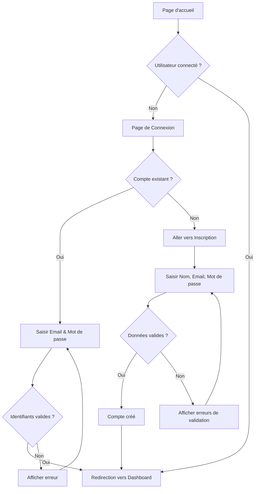
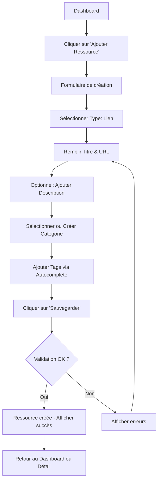
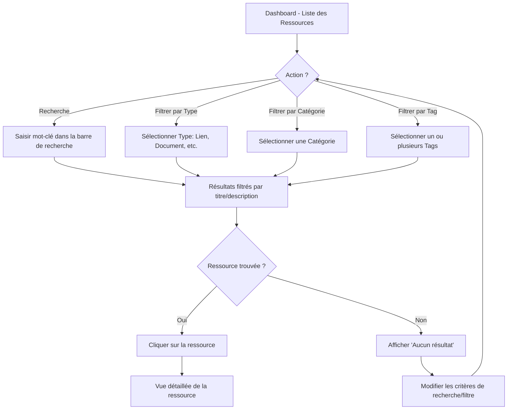
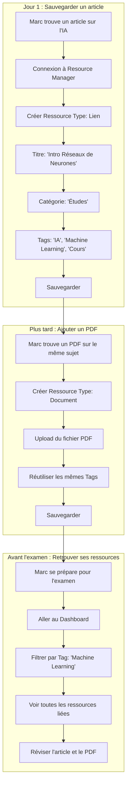

# Définition du Parcours Utilisateur (User Flow)

## 1. Qu'est-ce qu'un User Flow ?

Un **User Flow** (ou parcours utilisateur) est une représentation visuelle du chemin qu'un utilisateur emprunte à travers une application pour accomplir une tâche spécifique. Il décrit la séquence d'écrans, d'actions et de décisions que l'utilisateur rencontre depuis un point d'entrée jusqu'à l'atteinte de son objectif.

### 1.1 Objectifs du User Flow

*   **Visualiser l'expérience utilisateur** : Comprendre le trajet d'un utilisateur.
*   **Identifier les points de friction** : Repérer où les utilisateurs pourraient abandonner ou se perdre.
*   **Optimiser la navigation** : Simplifier les étapes pour atteindre un objectif.
*   **Communiquer au sein de l'équipe** : Servir de référence pour les développeurs, designers et stakeholders.

### 1.2 Composants d'un User Flow

| Composant | Description |
|---|---|
| **Point d'entrée** | L'écran ou l'état initial de l'utilisateur (ex: page d'accueil, lien externe). |
| **Actions** | Les interactions de l'utilisateur (clics, saisies, scrolls). |
| **Décisions** | Les points où l'utilisateur ou le système fait un choix (ex: conditions). |
| **Écrans/Pages** | Les différentes vues de l'application. |
| **Point de sortie** | L'objectif final ou la tâche accomplie. |

---

## 2. User Flows pour Resource Manager

Voici les principaux parcours utilisateurs identifiés pour le MVP de l'application.

### 2.1 Flow 1 : Authentification (Inscription / Connexion)

Ce flow décrit le processus d'accès à l'application.

---

### 2.2 Flow 2 : Création d'une Ressource (Lien)

Ce flow décrit comment un utilisateur ajoute une nouvelle ressource de type "Lien".

---

### 2.3 Flow 3 : Recherche et Filtrage

Ce flow décrit comment un utilisateur recherche et filtre ses ressources.

---

### 2.4 Flow 4 : Scénario Complet - Étudiant Organisant sa Recherche

Ce flow illustre le scénario d'utilisation décrit dans les spécifications (Section 6.1).

---

## 3. Bonnes Pratiques pour les User Flows

1.  **Garder le flow simple** : Éviter de surcharger le diagramme avec trop de détails.
2.  **Se concentrer sur un seul objectif** : Un flow = une tâche à accomplir.
3.  **Inclure les cas d'erreur** : Prévoir les chemins alternatifs (échecs de validation, etc.).
4.  **Itérer** : Les flows évoluent avec le produit, les mettre à jour régulièrement.
